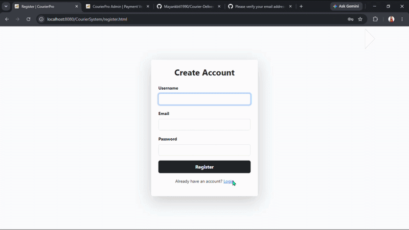

# 🚚 CourierPro - Automated Courier & Delivery Management System

A full-stack Java Web Application for managing parcel bookings, real-time delivery tracking, and administrative payment verification.

---

## 🎬 Live Project Demo

---

## 📸 Application Screenshots

| Booking & Payment Confirmation | Live Interactive Tracking |
| :---: | :---: |
|  |  |

| Admin Management Dashboard |
| :---: |
|  |

---

## 👥 Team & Roles

### 🧑‍💻  [Lokanshi](https://github.com/Lokanshi1405) — Full-Stack Developer (Admin & Tracking Systems)
- Backend Architecture: Developed AdminServlet and TrackServlet for live location updates and tracking status logic.
- Admin Dashboard UI: Built admin.jsp and admin_dashboard.html featuring UTR verification and package detail expansions.
- Dynamic Progress Tracking: Engineered dynamic JDBC status fetch queries and dynamic CSS transitions for live delivery dot updates.

### 👩‍💻 [Mayank](https://github.com/Mayankbtl1990) — Full-Stack Developer (User Booking & Auth Systems)
- User Workflow & UI: Designed and developed booking.html, payment.html, and registration interfaces using Bootstrap 5.
- Core Backend Servlets: Built BookingServlet, UserLoginServlet, and RegisterServlet handling database persistence and user session state.
- Payment Integration: Implemented UPI QR code rendering, localStorage shipment metric tracking, and UTR transaction input handling.

---

## 🚀 Key Features
- Live Parcel Tracking: Interactive UI featuring real-time tracking dot progress overrides with smooth CSS transitions.
- Admin Management Dashboard: UTR payment verification and expandable package details view.
- Dynamic Session Management: Role-based navigation preserving user login states across JSP and Servlet pages.

---

## 🛠️ Tech Stack
- Backend: Java Servlets, JSP, JDBC, MySQL
- Frontend: HTML5, CSS3, JavaScript, Bootstrap 5
- Server: Apache Tomcat 9.0
- Version Control: Git, GitHub
